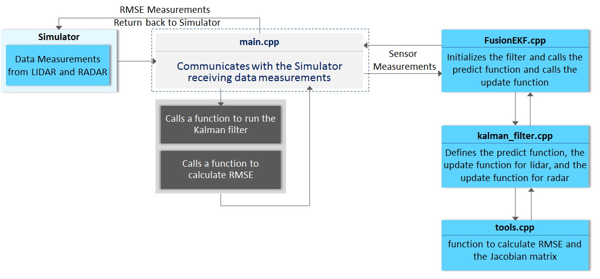
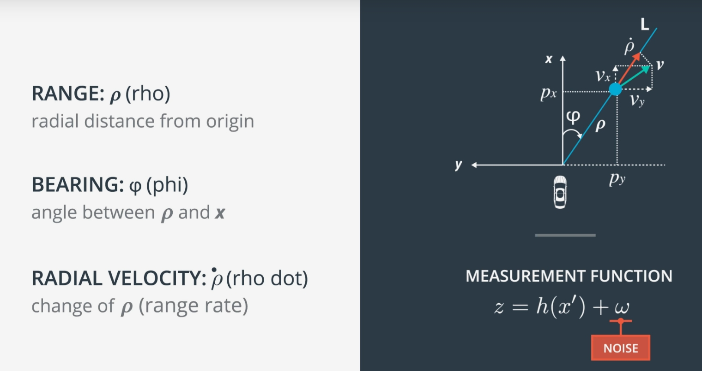
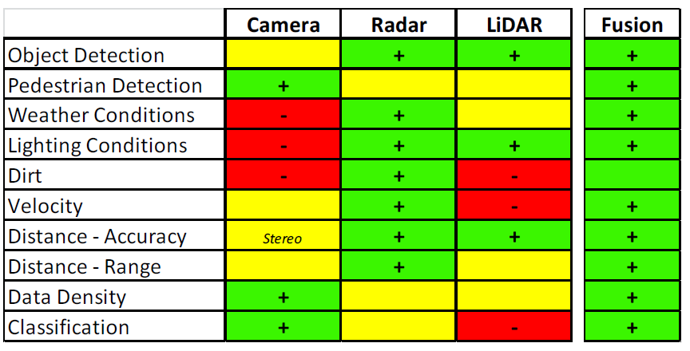
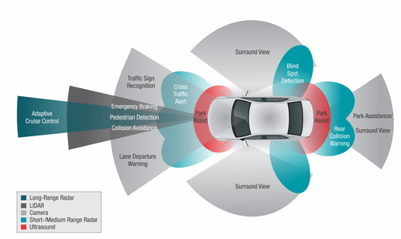
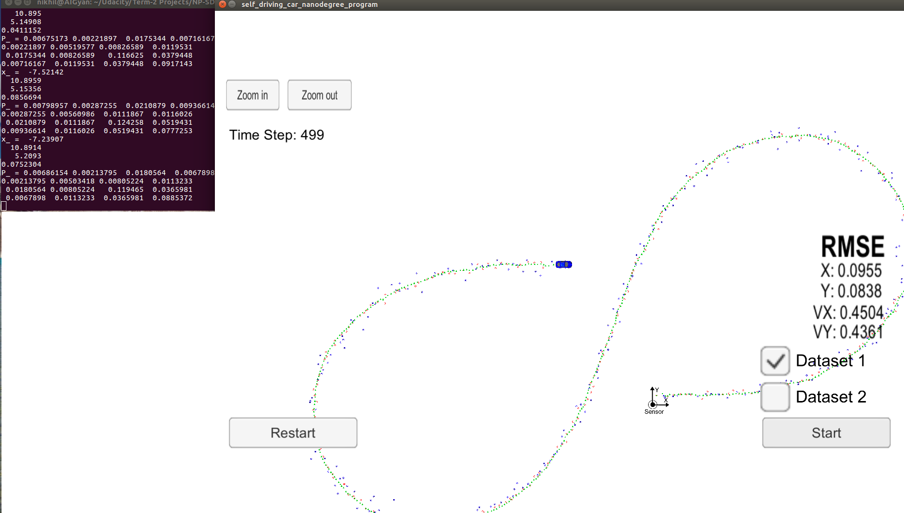

# Term - 2 - Project - 1 : Extended Kalman Filter - Object Tracking with Sensor Fusion
Udacity Self-Driving Car Nanodegree - Extended Kalman Filter Implementation

Dataset - 1 - Output             |  Dataset - 2 - Output
:-------------------------:|:-------------------------:
[](https://youtu.be/a17XRtIoIKI)  |  [](https://youtu.be/d516KaL_DKM)

## Overview
This project consists of implementing an [Extended Kalman Filter](https://en.wikipedia.org/wiki/Extended_Kalman_filter) with C++. A simulator provided by Udacity ([which is available here](https://github.com/udacity/self-driving-car-sim/releases)) generates RADAR and LIDAR measurements of the position and velocity of an object, and the Extended Kalman Filter[EKF] must use those measurements to predict the position of the object. The communication between the simulator and the EKF is done using [WebSocket](https://en.wikipedia.org/wiki/WebSocket) using the [uWebSockets](https://github.com/uNetworking/uWebSockets) implementation on the EKF side.
To get this project started, Udacity provides a seed project that could be found [here](https://github.com/udacity/CarND-Extended-Kalman-Filter-Project).

## Prerequisites

The project has the following dependencies (from Udacity's seed project):

- cmake >= 3.5
- make >= 4.1
- gcc/g++ >= 5.4
- Udacity's simulator.

For instructions on how to install these components on different operating systems, please, visit [Udacity's seed project](https://github.com/udacity/CarND-Extended-Kalman-Filter-Project). As this particular implementation was done on Linux Ubuntu, the rest of this documentation will be focused on Linux.

In order to install the necessary libraries, use the [install-xxxx.sh](./install-xxxx.sh) based on your operating system.

## Compiling and Executing the Project

These are the suggested steps:

1. Clone the repo and cd to it on a Terminal.
2. Make a build directory: `mkdir build && cd build`
3. Compile: `cmake .. && make`
4. Start the Simulator
5. Run it by the following command: 
   * `./ExtendedKF`
  
## Running the Filter

From the build directory, execute `./ExtendedKF`. The output should be:

```
Listening to port 4567
Connected!!!
```
## Code Flow
 

## Measurement Process
   **first measurement**: the filter will receive initial measurements of an object's position relative to the car. These measurements will come from a radar or lidar sensor.
   **initialize state and covariance matrices**: the filter will initialize the object's position based on the first measurement then the car will receive another sensor measurement after a time period Δt.
   **predict**: the algorithm will predict where the bicycle will be after time Δt. One basic way to predict the bicycle location after Δt is to assume the object's velocity is constant; thus the object will have moved velocity * Δt. 
   **update**: the filter compares the "predicted" location with what the sensor measurement says. The predicted location and the measured location are combined to give an updated location. The Kalman filter will put more weight on either the predicted location or the measured location depending on the uncertainty of each value then the car will receive another sensor measurement after a time period Δt. The algorithm then does another predict and update step.

 

## Lidar measurement
	- z = transpose (px py) is the measurement vector. For a lidar sensor, the z vector contains the position−x and position−y measurements.
	- H is the matrix that projects your belief about the object current state into the measurement space of the sensor. For lidar, this is a fancy way of saying that we discard velocity information from the state variable since the lidar sensor only measures position: The state vector x contains information about [p​x​​,p​y​​,v​x​​,v​y​​] whereas the z vector will only contain [px,py]. Multiplying Hx allows us to compare x, our belief, with z, the sensor measurement.

 

## Radar measurement:
	- The range, (ρ), is the distance to the pedestrian. The range is basically the magnitude of the position vector ρ which can be defined as ρ=sqrt(p​x​2​​+p​y​2​​).
	- φ=atan(p​y​​/p​x​​). Note that φ is referenced counter-clockwise from the x-axis, so φ from the video clip above in that situation would actually be negative.
	- The range rate, ​ρ​˙​​, is the projection of the velocity, v, onto the line, L.
 

## Comparison of Sensing Technologies

 
 
(Source: Texas Instruments)

**_Note_**:

* LIDAR wavelength in infrared; RADAR wavelength in mm. 
* LIDAR most affected by dirt and small debris.

## Results

- The RMSE values with both LASER and RADAR sensors are as follows:

|RMSE Values  |Px    |Py    |Vx    |Vy    |
|------|------|------|------|------|
|Dataset - 1  |0.0955|0.0838|0.4504|0.4361|
|Dataset - 2  |0.0744|0.0959|0.4586|0.4947|

Dataset - 1 - RMSE            |  Dataset - 2 - RMSE
:-------------------------:|:-------------------------:
  |  
